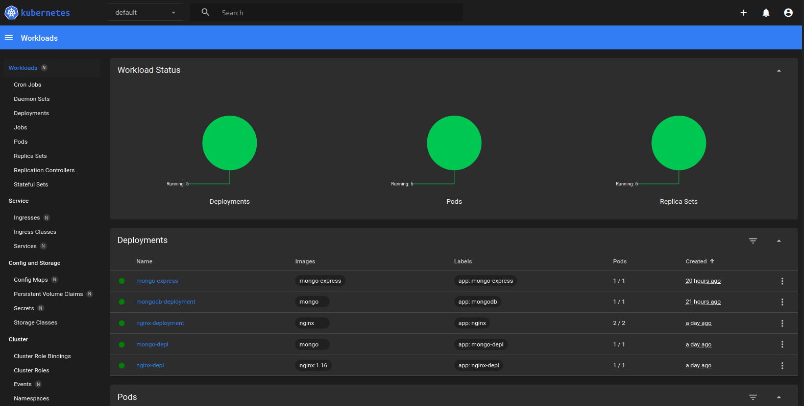

#  Kubernetes guide


# Table of Contents

1. [Prerequisites](#prerequisites)
2. [Getting Started](#getting-started)
   1. [Deployment](#deployment)
   2. [Pod examination and configuration](#pod-examination-and-configuration)
   3. [Commands and Debugging](#commands-and-debugging)
3. [Creating a custom configuration file](#creating-a-custom-configuration-file)
4. [Layers of Abstraction](#layers-of-abstraction)
5. [YAML Configuration File](#yaml-configuration-file)
6. [Complete Application Setup](#complete-application-setup)
7. [Namespaces](#namespaces)i
8. [Create Components in Namespaces](#create-components-in-namespaces)
9. [K8s Ingress](#k8s-ingress)
10. [Helm Package Manager](#helm-package-manager)
11. [Kubernetes Volumes](#kubernetes-volumes)
12. [Stateful and Stateless applications](#stateful-and-stateless-applications)
13. [To-Do Sections](#to-do-sections)
<br />

### Prerequisites

<br />


**Master & Worker Nodes**

`docker.io`-> Container runtime
 <br />
`kubelet` -> Daemon running on systemd. CRUD containers on Pods.
 <br />
`kubeadm` -> Performs the necessary actions to get a minimum viable cluster up and running. 
<br />
`kubectl` -> CLI againts K8s clusters, e.g. deploy applications, inspect and manage cluster resources, and view logs. 
<br />

### Optional packages

<br />

`https transport`

`curl`

---

## Getting started

Creating a cluster with minikube on host machine

> Install minikube to set a local K8s cluster. Not OS-specific.

`minikube start` <br />

`kubectl version --output=yaml` <br />
`kubectl cluster-info` <br />


View nodes in the cluster

`kubectl get nodes` 

<br />

## Deployment

`kubectl create deployment <name> --image<image-name-location>` 
`kubectl create deployment <name> --image<image-name-location>` <br />
> e.g. => kubectl create deployment kubernetes-bootcamp --image=gcr.io/google-samples/kubernetes-bootcamp:v1


List your deployments:

`kubectl get deployments` <br />


>Pods that are running inside Kubernetes are running on a private,
isolated network. By default they are visible from other pods and
services within the same kubernetes cluster, but not outside that
network. When we use kubectl, we\'re interacting through an API endpoint
to communicate with or application. 

In another terminal, run:

``` console
echo -e "\n\n\n\e[92mStarting Proxy. After starting it will not output a response.
Please click the first Terminal Tab\n"; 
kubectl proxy
```

In yet another terminal, run:

``` console
curl https://localhost:8001/version
```

>The API server will automatically create an endpoint for each pod, based
on the pod name, that is also accessible through the proxy. First we
need to get the Pod name, and we\'ll store in the environment variable
POD_NAME:


``` console
export POD_NAME=$(kubectl get pods -o go-template --template
 '{{range .items}}{{.metadata.name}}{{"\n"}}{{end}}')
```

You can access the Pod through the API by running:

``` console
curl http://localhost:8001/api/v1/namespaces/default/pods/$POD_NAME/ 
```


#### Pod examination and configuration

Pod status can be seen via the describe command of kubectl.

``` console
kubectl describe pod <pod-name>
```

Access to the contairer inside the Pod can be granted via the following
command, which iterrates an interactive terminal.

``` console
kubectl exec -it <pod-name> -- bin/bash
```


#### Commands and Debugging:

``` console
kubectl create deployment [name]
kubectl edit deployment [name]
kubectl delete deployment [name]
```


#### Status of different K8s components

``` console
kubectl get nodes|pod|services|replicaset|deployment
```


#### Debugging pods

``` console
kubectl logs [pod name]
kubectl exec -it [pod-name] -- bin/bash
```


## Creating a custom configuration file


Configuration files in K8s are of .yaml file format. After a Pod,
Container and Deployment are created, a config file can be
created/edited.

Creating a .yaml configuration file:

``` console
touch nginx-deployment.yaml
nvim nginx-deployment.yaml
```

>Nginx is a local web server that provides load balancing, allong with HTTP cache and reverse proxy.
<br />

>From the .yaml configuration file that will be created below, the nginx local server will be deployed inside a containerized environment.

Inside the .yaml file, a strict and specific syntax must be followed.

**Indentation must be strictly followed, otherwise it leads to errors.**

``` console
apiVersion: apps/v1
kind: Deployment
metadata:
  name: nginx-deployment
  labels:
    app: nginx
spec:       ##specification for the deployment
  replicas: 2
  selector:
    matchLabels:
      app: nginx
  template:
    metadata:
      labels:
        app: nginx
    spec:   ##specification for the pods
      containers:
      - name: nginx
        image: nginx
        ports:
        - containerPort: 80
```


##### User configuration files for CRUD.
After the config file has been created, it can be applied via the following command:

``` console
kubectl apply -f nginx-deployment.yaml
```

If we run the following command, we can see the new deployment is ready
and running:

``` console
kubectl get pod
```

Similarly for the deployment:

``` console
kubectl get deployment
```


### Layers of Abstraction:

<br />

##### Deployment -> ReplicaSet -> Pod -> Container


## YAML Configuration File 

#### **Strict Syntax Indentation!!**

<br />

>For autogenerating config files, K8s gets the status from the etch, which hold the current status of any K8s component!

<br />

The basic idea is that inside a `.yaml` configuration file exist other configuration files as `metadata` and `spec` sections.

`Pods` should have their own configuration inside of the `Deployments` configuration file. 
All `Pods` will be defined.

Inside the `metadata` of each `pod`, exist the `spec` section.
The `spec` section covers the name of the `container`, the `image` running inside the `container`, along with the `containerPort` inside the private network.

The connection between `Services` and `Deployments` is established with `Labels` and `Selectors`.

Specificlly, the `metadata` part contains the `labels`, and the `spec` part contains `Selectors`.

This way, the `Deployment` knows with `Pods` belong to specific applications.

The `Deployment` has its own label, which will be used by the `Service` selector which makes a connection between the `Service` and the `Deployment`.

#### Ports

Both `Service` and `Deployment` need to have `Ports` defined. 
That way, the DB Service knows with which port to communicate with the nginx Service, and to which `Pod` it 
should forward the request, but also which `Pods` are listening.

**Some examples:**

<table>
<tr>
<th>nginx-deployment.yaml</th>
<th>nginx-service.yaml</th>
</tr>
<tr>
<td>
<pre>
  apiVersion: apps/v1
kind: Deployment
metadata:
  name: nginx-deployment
  labels:
    app: nginx
spec:
  replicas: 2
  selector:
    matchLabels:
      app: nginx
  template:
    metadata:
      labels:
        app: nginx
    spec:
      containers:
      - name: nginx
        image: nginx:1.16
        ports:
        - containerPort: 8080
</pre>
</td>
<td>

```json
apiVersion: v1
kind: Service
metadata:
  name: nginx-service
spec:
  selector:
    app: nginx
  ports:
    - protocol: TCP
      port: 80
      targetPort: 8080
 
```

</td>
</tr>
</table>

After the configuration files are created, we can apply them to both deployment and service.

`kubectl apply -f nginx-deployment.yaml`

`kubectl apply -f nginx-service.yaml`

Now we can see that 2 replicas are running, as it was defined in the config file of the `nginx-deployment.yaml`

`kubectl get pod`

And the service we created from the `nginx-service.yaml` is up and running.

`kubectl get service`

----------------

Now we can get the information of the auto-generated config file of the `nginx-service` by running:

`kubectl describe service nginx-service`

Inside which description, we can find the `Endpoints`, which describe the IP-Addresses of the Pods, along with the port they're listening.

We can check if the ports of the `Pods` are correct by running:

`kubectl get pod -o wide`

-----------------

Finally, let's check the status, in .yaml format, that K8s automatically generates, and save it in a file:
The status info resides in the `etcd`, which stores the the status of the whole cluster, including every component.

`kubectl get deployment nginx-deployment -o yaml > nginx-deployment-result.yaml` 

>
<tr>
<th>nginx-deployment-result.yaml</th>
</tr>
<tr>
<td>
  
```json
apiVersion: apps/v1
kind: Deployment
metadata:
  annotations:
    deployment.kubernetes.io/revision: "1"
    kubectl.kubernetes.io/last-applied-configuration: |
      {"apiVersion":"apps/v1","kind":"Deployment","metadata":{"annotations":{},"labels":{"app":"nginx"},"name":"nginx-deployment","namespace":"default"},"spec":{"replicas":2,"selector":{"matchLabels":{"app":"nginx"}},"template":{"metadata":{"labels":{"app":"nginx"}},"spec":{"containers":[{"image":"nginx:1.16","name":"nginx","ports":[{"containerPort":8080}]}]}}}}
  creationTimestamp: "2023-03-23T10:54:56Z"
  generation: 1
  labels:
    app: nginx
  name: nginx-deployment
  namespace: default
  resourceVersion: "96574"
  selfLink: /apis/apps/v1/namespaces/default/deployments/nginx-deployment
  uid: e1075fa3-6468-43d0-83c0-63fede0dae51
spec:
  progressDeadlineSeconds: 600
  replicas: 2
  revisionHistoryLimit: 10
  selector:
    matchLabels:
      app: nginx
  strategy:
    rollingUpdate:
      maxSurge: 25%
      maxUnavailable: 25%
    type: RollingUpdate
  template:
    metadata:
      creationTimestamp: null
      labels:
        app: nginx
    spec:
      containers:
      - image: nginx:1.16
        imagePullPolicy: IfNotPresent
        name: nginx
        ports:
        - containerPort: 8080
          protocol: TCP
        resources: {}
        terminationMessagePath: /dev/termination-log
        terminationMessagePolicy: File
      dnsPolicy: ClusterFirst
      restartPolicy: Always
      schedulerName: default-scheduler
      securityContext: {}
      terminationGracePeriodSeconds: 30
status:
  availableReplicas: 2
  conditions:
  - lastTransitionTime: "2023-03-23T10:54:59Z"
    lastUpdateTime: "2023-03-23T10:54:59Z"
    message: Deployment has minimum availability.
    reason: MinimumReplicasAvailable
    status: "True"
    type: Available
  - lastTransitionTime: "2023-03-23T10:54:56Z"
    lastUpdateTime: "2023-03-23T10:54:59Z"
    message: ReplicaSet "nginx-deployment-7d64f4b574" has successfully progressed.
    reason: NewReplicaSetAvailable
    status: "True"
    type: Progressing
  observedGeneration: 1
  readyReplicas: 2
  replicas: 2
  updatedReplicas: 2
```

**We can delete the `Deployment` and `Service` by deleting the configuration files.**

`kubectl delete -f nginx-deployment.yaml`
`kubectl delete -f nginx-service.yaml`


<br />

## Complete Application Setup

Implementation of simple web application using `mongo-express` & `mongoDB`.

First, we're going to create a `mongoDB` `Pod`, and to talk to the `Pod` we're going to need a service.
We're going to create an Internal Service, meaning that no external requests are allowed to the pod, 
only components in the same cluster are able to talk to it.

Then we'll create a `mongo-express` `Deployment`

We'll create a `Deployment.yaml` for the `mongo-express` deployment, which will be provided with
environmental variables, that will allow it to connect to the `mongoDB`.

The `mongoDB` will consist of the following:

  - ConfigMap -> DB URL
  - Secret    -> DB User, DB Pwd

So the Request Flow will look like the following:

>The request comes from the browser, it goes through the `mongo-express external Service`, which will forward
it to the `mongo-express` `Pod`. 
The `Pod` then will connect to the `mongoDB` Internal Service, which will forward it to the `mongoDB` `Pod`, 
where it will authenticate the request by using the credentials of the `Secret` module of the `mongoDB`.


 - Start `minikube` if using a local cluster instance in your host machine.

 - Run `kubectl get all` to view all the components inside the cluster.

##### Step 1:

  Create the `mongoDB` Deployment.

<table>
<tr>
<th>mongo.yaml</th>
<th>mongodb-secret.yaml</th>
</tr>
<tr>
<td>
<pre>
apiVersion: apps/v1
kind: Deployment
metadata:
  name: mongodb-deployment
  labels:
    app: mongodb
spec:
  replicas: 1
  selector:
    matchLabels:
      app: mongodb
  template:
    metadata:
      labels:
        app: mongodb
    spec:
      containers:
      - name: mongodb
        image: mongo
        ports:
        - containerPort: 27017
        env:
        - name: MONGO_INITDB_ROOT_USERNAME
          valueFrom:
            secretKeyRef:
              name: mongodb-secret
              key: mongo-root-username
        - name: MONGO_INITDB_ROOT_PASSWORD
          valueFrom: 
            secretKeyRef:
              name: mongodb-secret
              key: mongo-root-password
  ---
  apiVersion: v1
  kind: Service
  metadata:
    name: mongodb-service
  spec:
    selector:
      app: mongodb
    ports:
      - protocol: TCP
        port: 27017
        targetPort: 27017

</pre>
</td>
<td>

```
apiVersion: v1
kind: Secret
metadata:
    name: mongodb-secret
type: Opaque
data:
    mongo-root-username: dXNlcm5hbWU=    #generated as base64 value with command 
    mongo-root-password: cGFzc3dvcmQ=    # `echo -n 'username/password' | base64

```

</td>
</tr>
</table>


<br /> 

Then we can apply the secret with `kubectl`

`kubectl apply -f mongodb-secret.yaml`

Check the `secret` status:

`kubectl get secret`

Create the deployment

`kubectl apply -f mongo.yaml`

Check the pod status

`kubectl get pod`

> If it takes a bit for the `pod` to be created, you can run `kubectl get pod --watch` to have live feedback.


<br />
### Step 2: Create an internal service so that other `pods` can talk to the `mongodb`

See ending section of file `mongo.yaml` in Step 1.

<br />

### Step 3: Create Mongo Express Extenral Service, along with a ConfigurationMap file, in which we'll add the database URL.

<br />

<table>
<tr>
<th>mongo-express.yaml</th>
</tr>
<tr>
<td>
<pre>
apiVersion: apps/v1
kind: Deployment
metadata:
  name: mongodb-deployment
  labels:
    app: mongodb
spec:
  replicas: 1
  selector:
    matchLabels:
      app: mongodb
  template:
    metadata:
      labels:
        app: mongodb
    spec:
      containers:
      - name: mongodb
        image: mongo
        ports:
        - containerPort: 27017
        env:
        - name: MONGO_INITDB_ROOT_USERNAME
          valueFrom:
            secretKeyRef:
              name: mongodb-secret
              key: mongo-root-username
        - name: MONGO_INITDB_ROOT_PASSWORD
          valueFrom: 
            secretKeyRef:
              name: mongodb-secret
              key: mongo-root-password
  ---
  apiVersion: v1
  kind: Service
  metadata:
    name: mongodb-service
  spec:
    selector:
      app: mongodb
    ports:
      - protocol: TCP
        port: 27017
        targetPort: 27017

</pre>
</td>
</tr>
</table>

<br /> 

#### Apply the ConfigMap:

`kubectl apply -f mongo-configmap.yaml`

#### Apply the Mongo-Express:

`kubectl apply -f mongo-express.yaml`

We can see the logs for further information and confirmation that everything is going smoothly:

`kubectl logs mongo-express-5bf4b56f47-5n9vq` 
>change the name of the mongo-express with the name if the instance in your machine.


<table>
<tr>
<th>Mongo-express logs</th>
<th></th>
</tr>
<tr>
<td>
<pre>


Welcome to mongo-express
------------------------


(node:7) [MONGODB DRIVER] Warning: Current Server Discovery and Monitoring engine is deprecated, and will be removed in a future version. To use the new Server Discover and Monitoring engine, pass option { useUnifiedTopology: true } to the MongoClient constructor.
Mongo Express server listening at http://0.0.0.0:8081
Server is open to allow connections from anyone (0.0.0.0)
basicAuth credentials are "admin:pass", it is recommended you change this in your config.js!

</pre>
</td>
</tr>
</table>

<br />

Now that everything is running correctly, the last step is to create an external service
so that we can access the mongo-express from a browser.

---


#### Let's create an external service for the mongo-express.

<br />


<table>
<tr>
<th>mongo-express.yaml</th>
</tr>
<tr>
<td>
<pre>
apiVersion: apps/v1
kind: Deployment
metadata:
  name: mongo-express
  labels:
    app: mongo-express
spec:
  replicas: 1
  selector:
    matchLabels:
      app: mongo-express
  template:
    metadata:
      labels:
        app: mongo-express
    spec:
      containers:
      - name: mongo-express
        image: mongo-express
        ports:
        - containerPort: 8081
        env:
        - name: ME_CONFIG_MONGODB_ADMINUSERNAME
          valueFrom:
            secretKeyRef:
              name: mongodb-secret
              key: mongo-root-username
        - name: ME_CONFIG_MONGODB_ADMINPASSWORD
          valueFrom: 
            secretKeyRef:
              name: mongodb-secret
              key: mongo-root-password
        - name: ME_CONFIG_MONGODB_SERVER
          valueFrom: 
            configMapKeyRef:
              name: mongodb-configmap
              key: database_url
---
apiVersion: v1
kind: Service
metadata:
  name: mongo-express-service
spec:
  selector:
    app: mongo-express
  type: LoadBalancer  
  ports:
    - protocol: TCP
      port: 8081
      targetPort: 8081
      nodePort: 3000>

</pre>
</td>
</tr>
</table>

<br /> 

Now, running the command:

`kubectl get service`

will give us all the information we need for the service that was created.
Most importantly, the Cluster-IP address, along with port and the type of the service.

The External-IP address is not yet specified, so we need to assign to an external service a public IP-Adress.

`minikube service mongo-express-service`

And as a result, a browser will open automatically to the Mongo Express page.

---------------

# Namespaces

Namespaces can be used to organize resources in a cluster.

A cluster can have multiple Namespaces. It helps to think of Namespaces as virtual
cluster inside a Kubernetes cluster.

Upon cluster creation, K8s gives us 4 default Namespaces.

The following command can be run to view said namespaces:

`kubectl get namespaces`

|Namespaces	           |Function                                                                    	|
|---       	           |---	                                                                          |
| defualt              |  Resources you create are located here.                            	        |
| kube-node-lease      |  Holds info on the heartbeats of nodes. Determines the availability of a node|
| kube-public          |  Contains the publicly-accesible data.         	                            |
| kube-system          |  Not to be altered, contains system processes                                |
| kubernetes-dashboard |  Minikube-Specific                                                           |

To create a new namespace, use the following command or via a config file:

`kubectl create namespace my-namespace` 

### What is the need for namespaces?

Can compartmentalize all components of a cluster for easier user.
Especially if there are multiple instances of Deployments, Pods, Services and configmaps inside a Cluster.

E.g. There can be different namespaces for Monitoring tools, Database, etc.

Also important if multiple teams use the same Deployment.
What this offers, is that all teams can use the same deployment, inside the same cluster, 
but use a different Namespace, as not to disrupt each other.

Another use case is Resource Sharing: Staging and Development.
That way you can deploy in one cluster, and every namespace has access to the resources of the deployment.

### Create Components in Namespaces

Let's create a `configmap` file inside a specific Namespace.

<table>
<tr>
<th>mysql-configmap.yaml</th>
</tr>
<tr>
<td>
<pre>
 apiVersion: v1
 kind: ConfigMap
 metadata:
  name: mysql-configmap
 data:
  db_url: mysql-service.database

</pre>
</td>
</tr>
</table>

**If no namespace flag is given, the configmap will be created in the default namespace**

`kubectl apply -f mysql-configmap.yam --namespace=my-namespace`

Alternatively, the namespace can be specified inside the config file.

<table>
<tr>
<th>mysql-configmap.yaml</th>
</tr>
<tr>
<td>
<pre>
 apiVersion: v1
 kind: ConfigMap
 metadata:
  name: mysql-configmap
  namespace: my-namespace
 data:
  db_url: mysql-service.database

</pre>
</td>
</tr>
</table>

To see the configmap inside the custom namespace:

`kubectl get configmap -n my-namespace`

**Also check `kubens` for changing the default namespace**

-------
# K8s Ingress

Ingress replaces the external service of an application, most likely in production, 
so that the user can navigate to the service via brower with a `https` `domain name`
instead of th `IP Address` and the specific `Port` of the application.

## External Service vs Ingress Configuration Files

<table>
<tr>
<table>
<tr>
<th>external-service.yaml</th>
<th>ingress.yaml</th>
</tr>
<tr>
<td>
<pre>
 apiVersion: v1
 kind: Service
 metadata:
  name: myapp-external-service
 spec:
  selector:
    app: myapp
  type: LoadBalancer
  ports:
    - protocol: TCP
      port: 8080
      targetPort: 8080
      nodePort: 35010
</pre>
</td>
<td>

```
apiVersion: networking.k8s.io/v1
kind: Ingress
metadata:
  name: dashboard-ingress
  namespace: kubernetes-dashboard
  annotations:
    kubernetes.io/ingress.class: "nginx"
spec:
  rules:
  - host: dashboard.com
    http:
      paths:
      - path: /
        pathType: Exact  
        backend:
          service:
            name: kubernetes-dashboard
            port: 
              number: 80

```

</td>
</tr>
</table>


After the application of the configuration files have been executed with:

`kubectl aply-f dashboard-ingress.yaml`

Run the following command to get the status of the ingress:

`kubectl get ingress -n kubernetes-dashboard`

Now we can see the IP-Address of the dashboard we created along with the domain name.

|NAME|CLASS|HOSTS|ADDRESS|PORTS|AGE|
|--- |---  |---  |---    |---  |---|
|dashboard-ingress|<none>|dashboard.com|192.168.49.2|80|23m|

Next, we need to add the IP Address and the domain name to the /etc/hosts file of the machine/cluster.

`sudo -- sh -c "echo '192.168.49.2 dashboard.com' >> /etc/hosts"`

Optional: There may be need for the command `kubectl proxy`to be run in another terminal.

Now we can access the domain `dashboard.com`

Finally, a token needs to be generated via the command :

`kubectl -n kubernetes-dashboard create token admin-user`

And we have been granted access to the dashboard:



---
# Helm Package Manager

Helm Package Manager is a user repository that allows user to user already implemented
deployment containers that can be added to specific deployments via `.yaml` configuration files.

Package repositories, known as Helm Charts, can be accessed via `CLI` of `Helm Hum`.

`helm search <keyword>`

Helm can also be used as a `Templating Eninge`.

Specifically in cases that there exists multiple microservices of the same nature, but different versions, 
a common blueprint can be defined and also the dynamic values are replaced by placeholders.

In essense, Helm helps with version control, along with deployment rollout services.


---
# Kubernetes Volumes

This section covers the topic of persisting data in Kubernetes using volums.

There are 3 components of Kubernetes storage:

  1. Persistent Volume
  2. Persistent Volume Claim
  3. Storage Class

Storage Requirements:

 - Storage that doesn't depend on the pod lifecycle.
 - Storage must be available on all nodes.
 - Storage needs to survive even if cluster crashes.

### Persistent Volume

Persistent Volume is a cluster resource, similar to the CPU or RAM that is used to store data.
Just like any other K8s component, it is created via `.yaml` configuration file, on which
the kind of the component is specified, along with the storage capacity and access permission.

Each Cluster can have multiple storage options (local/nfs or cloud) configured for simultaneously usage.

### Persistent Volume Claim

Persistent Volume Claim (pvc) is configured also via a `.yaml` configuration file that specifies
the storage volume type and capacity it wants to claim, along with other criteria.

**<u>Note </u>:** PVCs must be in the same namespace as the Pod using the claim!


### Storage Class

A StorageClass provides a way for administrators to describe the "classes" of storage they offer.

Example `.yaml`

```
apiVersion: storage.k8s.io/v1
kind: StorageClass
metadata:
  name: standard
provisioner: kubernetes.io/aws-ebs
parameters:
  type: gp2
reclaimPolicy: Retain
allowVolumeExpansion: true
mountOptions:
  - debug
volumeBindingMode: Immediate
```

# Stateful and Stateless applications

In Kubernetes, applications can be classified as either stateful or stateless. The classification depends on how an application manages its state, that is,
the data that it needs to store and retrieve over time.

Stateless applications do not require persistent storage of data, meaning that the application does not need to store any information between requests. 
They are designed to be easily replicated and scaled horizontally, which means that multiple instances of the application can be running at the same time,
and requests can be load balanced across them. Stateless applications are often used for web servers, load balancers, or microservices that perform a specific function.

Stateful applications, on the other hand, require persistent storage of data, meaning that the application needs to store and retrieve data over time.
They are typically more complex to manage than stateless applications because they have data dependencies and require data to be maintained across instances.
Examples of stateful applications include databases, key-value stores, and file systems.

When deploying stateful applications in Kubernetes, it is important to consider the storage requirements and how data will be managed across instances.
Kubernetes provides features such as StatefulSets, which allow you to manage stateful applications and ensure that each instance is uniquely identifiable
and has persistent storage. This makes it easier to scale and manage stateful applications in a Kubernetes environment.

# K8s Services Overview:

Kubernetes (k8s) is a container orchestration platform that allows you to manage, scale, and deploy containerized applications. One of the key features of
Kubernetes is the ability to define and manage services, which provide network connectivity to groups of pods running your application.

Here is an overview of Kubernetes services:

  - ClusterIP: This is the default service type in Kubernetes. It provides a virtual IP address that can be used to access pods within the same cluster.
  - ClusterIP services are only accessible from within the cluster.
  - NodePort: This service type exposes a port on every node in the cluster, and routes traffic to the associated pod. NodePort services are accessible 
  from outside the cluster by connecting to the node's IP address and the specified port.
  - LoadBalancer: This service type provisions a load balancer in the cloud provider's infrastructure and directs traffic to the associated pod. LoadBalancer
  services are accessible from outside the cluster through the load balancer's IP address.
  - ExternalName: This service type maps a service name to an external DNS name, allowing pods within the cluster to access an external service without exposing
  the external name to the pod.

Overall, Kubernetes services allow you to easily expose your application to the outside world and manage the network connectivity between your application's components.


